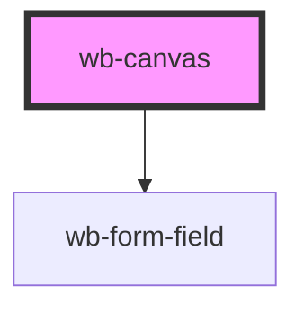

# wb-canvas

<!-- Auto Generated Below -->

## Overview

Reorderable field list. Ported from the standalone touch-drag spike.

Key difference from that spike: rows are keyed by field id (`key={f.id}`
below), so Stencil's virtual-DOM diff reuses the same DOM node for a row
across re-renders instead of destroying/recreating it. That's what caused
the original bug (re-render killed the element mid-drag, silently ending
pointer capture) — keyed VDOM avoids it by construction, as long as the
key stays stable across the reorder.

## Events

| Event               | Description | Type                                                      |
| ------------------- | ----------- | --------------------------------------------------------- |
| `wbChange`          |             | `CustomEvent<FieldMeta[]>`                                |
| `wbFieldDeselected` |             | `CustomEvent<void>`                                       |
| `wbFieldRemoved`    |             | `CustomEvent<{ id: number; }>`                            |
| `wbFieldSelected`   |             | `CustomEvent<FieldMeta>`                                  |
| `wbFieldUpdated`    |             | `CustomEvent<{ id: number; patch: Partial<FieldMeta>; }>` |

## Methods

### `addField(type: FieldMeta["type"], label: string, subtype?: FieldSubtype, design?: { kind: "design"; designType: FieldMeta["designType"]; }) => Promise<void>`

#### Parameters

| Name      | Type                                                            | Description |
| --------- | --------------------------------------------------------------- | ----------- |
| `type`    | `"select" \| "text" \| "date" \| "checkbox" \| "richtext"`      |             |
| `label`   | `string`                                                        |             |
| `subtype` | `"number" \| "text" \| "email" \| "tel" \| "url" \| "password"` |             |
| `design`  | `{ kind: "design"; designType: DesignType; }`                   |             |

#### Returns

Type: `Promise<void>`

### `addFieldAfter(type: FieldMeta["type"], label: string, subtype?: FieldSubtype, design?: { kind: "design"; designType: FieldMeta["designType"]; }) => Promise<void>`

#### Parameters

| Name      | Type                                                            | Description |
| --------- | --------------------------------------------------------------- | ----------- |
| `type`    | `"select" \| "text" \| "date" \| "checkbox" \| "richtext"`      |             |
| `label`   | `string`                                                        |             |
| `subtype` | `"number" \| "text" \| "email" \| "tel" \| "url" \| "password"` |             |
| `design`  | `{ kind: "design"; designType: DesignType; }`                   |             |

#### Returns

Type: `Promise<void>`

### `beginExternalDrag() => Promise<void>`

#### Returns

Type: `Promise<void>`

### `cancelExternalDrag() => Promise<void>`

#### Returns

Type: `Promise<void>`

### `commitExternalInsert(type: FieldMeta["type"], label: string, subtype?: FieldSubtype, design?: { kind: "design"; designType: FieldMeta["designType"]; }) => Promise<void>`

#### Parameters

| Name      | Type                                                            | Description |
| --------- | --------------------------------------------------------------- | ----------- |
| `type`    | `"select" \| "text" \| "date" \| "checkbox" \| "richtext"`      |             |
| `label`   | `string`                                                        |             |
| `subtype` | `"number" \| "text" \| "email" \| "tel" \| "url" \| "password"` |             |
| `design`  | `{ kind: "design"; designType: DesignType; }`                   |             |

#### Returns

Type: `Promise<void>`

### `getNextElementId() => Promise<number>`

Returns the id the next insertion will mint, without consuming it.

#### Returns

Type: `Promise<number>`

### `importState(fieldsOrState: FieldMeta[] | { fields: FieldMeta[]; nextId?: number; }) => Promise<void>`

#### Parameters

| Name            | Type                                                       | Description |
| --------------- | ---------------------------------------------------------- | ----------- |
| `fieldsOrState` | `FieldMeta[] \| { fields: FieldMeta[]; nextId?: number; }` |             |

#### Returns

Type: `Promise<void>`

### `removeField(id: number) => Promise<void>`

Remove the field with `id` anywhere in the tree (top level or nested
inside row-container columns). Deleting a row container removes its whole
`children` subtree. No-op when no field with that id exists. Never
decrements the id counter, so removed ids are never reused; the next id
can be peeked via [[getNextElementId]].

Emits, in order: `wbFieldDeselected` (only when the removed id or an id
inside a removed subtree was selected), `wbFieldRemoved` with `{ id }`,
then `wbChange` with the updated field list.

#### Parameters

| Name | Type     | Description |
| ---- | -------- | ----------- |
| `id` | `number` |             |

#### Returns

Type: `Promise<void>`

### `selectField(id: number | null) => Promise<void>`

#### Parameters

| Name | Type     | Description |
| ---- | -------- | ----------- |
| `id` | `number` |             |

#### Returns

Type: `Promise<void>`

### `setExternalHoverIndex(x: number, y: number) => Promise<void>`

#### Parameters

| Name | Type     | Description |
| ---- | -------- | ----------- |
| `x`  | `number` |             |
| `y`  | `number` |             |

#### Returns

Type: `Promise<void>`

### `updateField(id: number, patch: Partial<FieldMeta>) => Promise<void>`

#### Parameters

| Name    | Type                                                                                                                                                                                                                                                                                                                                                                    | Description |
| ------- | ----------------------------------------------------------------------------------------------------------------------------------------------------------------------------------------------------------------------------------------------------------------------------------------------------------------------------------------------------------------------- | ----------- |
| `id`    | `number`                                                                                                                                                                                                                                                                                                                                                                |             |
| `patch` | `{ id?: number; kind?: ElementKind; type?: FieldType; label?: string; subtype?: TextSubtype; required?: boolean; restrictions?: Restrictions; multiline?: boolean; initialLines?: number; maxHeight?: number; placeholder?: string; options?: { key: string; label: string; }[]; designType?: DesignType; text?: string; columns?: number; children?: FieldMeta[][]; }` |             |

#### Returns

Type: `Promise<void>`

## Dependencies

### Depends on

- [wb-form-field](../wb-form-field)

### Graph

----------------------------------------------

*Built with [StencilJS](https://stenciljs.com/)*
