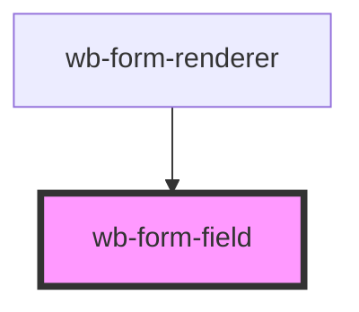

# wb-form-field

<!-- Auto Generated Below -->

## Overview

Renders ONE field from the JSON Schema / UI Schema pair and participates
natively in an ancestor <form> via ElementInternals — confirmed working
inside shadow DOM (including native validation-bubble anchoring) in the
standalone spike this replaces.

Multiple fields are namespaced by `name`, which should be the JSON
Pointer path from the schema (e.g. "personal.email"), not a bare label —
see the collision risk noted after the ElementInternals spike.

## Properties

| Property             | Attribute  | Description                                                              | Type                                         | Default     |
| -------------------- | ---------- | ------------------------------------------------------------------------ | -------------------------------------------- | ----------- |
| `label` _(required)_ | `label`    |                                                                          | `string`                                     | `undefined` |
| `name` _(required)_  | `name`     | JSON Pointer path used as the form-submission key, e.g. "personal.email" | `string`                                     | `undefined` |
| `required`           | `required` |                                                                          | `boolean`                                    | `false`     |
| `restrictions`       | --         |                                                                          | `Restrictions`                               | `undefined` |
| `subtype`            | `subtype`  |                                                                          | `"email" \| "number" \| "tel" \| "text"`     | `undefined` |
| `type`               | `type`     |                                                                          | `"checkbox" \| "date" \| "select" \| "text"` | `'text'`    |

## Dependencies

### Used by

 - [wb-form-renderer](../wb-form-renderer)

### Graph

----------------------------------------------

*Built with [StencilJS](https://stenciljs.com/)*
