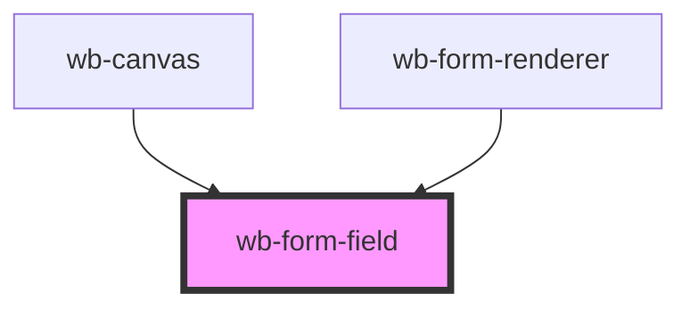

# wb-form-field

## CSS Custom Properties

| Name                              | Applies To                                                            | Fallback            | Description                          |
| --------------------------------- | --------------------------------------------------------------------- | ------------------- | ------------------------------------ |
| `--wb-field-font-size`            | `.wb-field`                                                           | `14px`              | Container font size                  |
| `--wb-field-label-font-size`      | `.wb-field__label`                                                    | `12px`              | Label font size                      |
| `--wb-field-label-color`          | `.wb-field__label`                                                    | `#55554f`           | Label text color                     |
| `--wb-field-label-margin-bottom`  | `.wb-field__label`                                                    | `4px`               | Space below the label                |
| `--wb-field-required-mark-color`  | `.required-mark`                                                      | `#e53e3e`           | Required asterisk color              |
| `--wb-field-input-width`          | Native inputs, textarea, select                                       | `100%`              | Native input width                   |
| `--wb-field-input-padding`        | Native inputs, textarea, select                                       | `8px 10px`          | Native input padding                 |
| `--wb-field-input-font-size`      | Native inputs, textarea, select                                       | `15px`              | Native input font size               |
| `--wb-field-input-border`         | Native inputs, textarea, select                                       | `1px solid #ddd`    | Native input border                  |
| `--wb-field-input-border-radius`  | Native inputs, textarea, select                                       | `8px`               | Native input border radius           |
| `--wb-field-textarea-min-height`  | `.wb-field__textarea`                                                 | `fit-content`       | Textarea minimum height              |
| `--wb-field-select-background`    | `.wb-field__select`                                                   | `#fff`              | Select background color              |
| `--wb-field-checkbox-gap`         | `.wb-field--checkbox__row`                                            | `8px`               | Space between checkbox and label     |
| `--wb-field-checkbox-accent-color`| `.wb-field--checkbox input`                                           | `#2f6fed`           | Checkbox accent color                |
| `--wb-field-disabled-background`  | Disabled native inputs, textarea, select, richtext editor             | `#fff`              | Background of disabled controls      |
| `--wb-field-hint-font-size`       | `.wb-field__placeholder-hint`                                         | `12px`              | Placeholder helper text font size    |
| `--wb-richtext-editor-padding`    | `.wb-richtext__editor`                                               | `8px 10px`          | Richtext editor padding              |
| `--wb-richtext-editor-min-height` | `.wb-richtext__editor`                                               | `96px`              | Richtext editor minimum height       |
| `--wb-richtext-editor-width`      | `.wb-richtext__editor`                                               | `100%`              | Richtext editor width                |
| `--wb-richtext-line-height`       | `.wb-richtext__editor .tiptap`                                       | `1.5`               | Richtext editor line height          |
| `--wb-richtext-paragraph-margin`  | `.wb-richtext__editor .tiptap p`                                     | `0 0 0.4em`         | Paragraph margin                     |
| `--wb-richtext-heading-margin`    | `.wb-richtext__editor .tiptap h2, h3`                                | `0.4em 0`           | Heading margin                       |
| `--wb-richtext-toolbar-margin-bottom` | `.wb-richtext__toolbar`                                          | `4px`               | Space below the toolbar              |
| `--wb-richtext-btn-padding`       | `.wb-richtext__btn`                                                  | `4px 8px`           | Toolbar button padding               |
| `--wb-richtext-btn-font-size`     | `.wb-richtext__btn`                                                  | `12px`              | Toolbar button font size             |
| `--wb-richtext-btn-line-height`   | `.wb-richtext__btn`                                                  | `1.4`               | Toolbar button line height           |
| `--wb-richtext-btn-hover-border-color` | `.wb-richtext__btn:hover`                                       | `#bbb`              | Toolbar button hover border color    |
| `--wb-richtext-linkbar-gap`       | `.wb-richtext__linkbar`                                              | `6px`               | Link bar item gap                    |
| `--wb-richtext-linkbar-margin-bottom` | `.wb-richtext__linkbar`                                          | `4px`               | Space below the link bar             |
| `--wb-richtext-linkbar-input-min-width` | `.wb-richtext__linkbar input`                                  | `160px`             | Link bar input minimum width         |
| `--wb-richtext-linkbar-input-padding` | `.wb-richtext__linkbar input`                                    | `6px 8px`           | Link bar input padding               |
| `--wb-richtext-linkbar-input-font-size` | `.wb-richtext__linkbar input`                                  | `13px`              | Link bar input font size             |
| `--wb-richtext-linkbar-input-border` | `.wb-richtext__linkbar input`                                     | `1px solid #ddd`    | Link bar input border                |
| `--wb-richtext-linkbar-input-border-radius` | `.wb-richtext__linkbar input`                              | `6px`               | Link bar input border radius         |
| `--wb-richtext-error-color`       | `.wb-richtext__error`                                                | `#e53e3e`           | Richtext error text color            |
| `--wb-richtext-error-font-size`   | `.wb-richtext__error`                                                | `12px`              | Richtext error font size             |
| `--wb-richtext-quote-border`      | `.wb-richtext__editor .tiptap blockquote`                            | `3px solid #ddd`    | Blockquote left border               |
| `--wb-richtext-quote-color`       | `.wb-richtext__editor .tiptap blockquote`                            | `#55554f`           | Blockquote text color                |
| `--wb-richtext-quote-margin`      | `.wb-richtext__editor .tiptap blockquote`                            | `0.4em 0`           | Blockquote margin                    |
| `--wb-richtext-quote-padding-left` | `.wb-richtext__editor .tiptap blockquote`                           | `10px`              | Blockquote left padding              |

`box-sizing` is always `border-box` and is not exposed as a CSS custom property. Layout-critical properties (`resize`, `field-sizing`, `appearance`, `display`, `flex`) remain literal.

<!-- Auto Generated Below -->

## Overview

Renders ONE field from the JSON Schema / UI Schema pair and participates
natively in an ancestor <form> via ElementInternals — confirmed working
inside shadow DOM (including native validation-bubble anchoring) in the
standalone spike this replaces.

Multiple fields are namespaced by `name`, which should be the JSON
Pointer path from the schema (e.g. "personal.email"), not a bare label —
see the collision risk noted after the ElementInternals spike.

## Properties

| Property             | Attribute       | Description                                                                                                                                                                     | Type                                                            | Default     |
| -------------------- | --------------- | ------------------------------------------------------------------------------------------------------------------------------------------------------------------------------- | --------------------------------------------------------------- | ----------- |
| `disabled`           | `disabled`      | When true, the control is rendered inert (not focusable/editable) but keeps its normal enabled appearance.                                                                      | `boolean`                                                       | `false`     |
| `initialLines`       | `initial-lines` |                                                                                                                                                                                 | `number`                                                        | `undefined` |
| `label` _(required)_ | `label`         |                                                                                                                                                                                 | `string`                                                        | `undefined` |
| `maxHeight`          | `max-height`    |                                                                                                                                                                                 | `number`                                                        | `undefined` |
| `multiline`          | `multiline`     |                                                                                                                                                                                 | `boolean`                                                       | `false`     |
| `name` _(required)_  | `name`          | JSON Pointer path used as the form-submission key, e.g. "personal.email"                                                                                                        | `string`                                                        | `undefined` |
| `options`            | --              | Ordered list of selectable choices rendered as `<option>` children for `type="select"`.                                                                                         | `{ key: string; label: string; }[]`                             | `undefined` |
| `placeholder`        | `placeholder`   | Presentation-only hint text for all fillable data field types: native attribute on text/textarea, hint option on select, helper text on date/checkbox, Tiptap hint on richtext. | `string`                                                        | `undefined` |
| `required`           | `required`      |                                                                                                                                                                                 | `boolean`                                                       | `false`     |
| `restrictions`       | --              |                                                                                                                                                                                 | `Restrictions`                                                  | `undefined` |
| `subtype`            | `subtype`       |                                                                                                                                                                                 | `"email" \| "number" \| "password" \| "tel" \| "text" \| "url"` | `undefined` |
| `type`               | `type`          |                                                                                                                                                                                 | `"checkbox" \| "date" \| "richtext" \| "select" \| "text"`      | `'text'`    |

## Dependencies

### Used by

 - [wb-canvas](../wb-canvas)
 - [wb-form-renderer](../wb-form-renderer)

### Graph

```mermaid
graph TD;
  wb-canvas --> wb-form-field
  wb-form-renderer --> wb-form-field
  style wb-form-field fill:#f9f,stroke:#333,stroke-width:4px
```

----------------------------------------------

*Built with [StencilJS](https://stenciljs.com/)*
