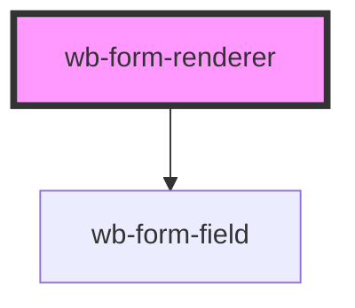

# wb-form-renderer

<!-- Auto Generated Below -->

## Properties

| Property | Attribute | Description | Type          | Default |
| -------- | --------- | ----------- | ------------- | ------- |
| `fields` | --        |             | `FieldMeta[]` | `[]`    |

## Events

| Event      | Description | Type                  |
| ---------- | ----------- | --------------------- |
| `wbSubmit` |             | `CustomEvent<string>` |

## Methods

### `setFields(fields: FieldMeta[]) => Promise<void>`

#### Parameters

| Name     | Type          | Description |
| -------- | ------------- | ----------- |
| `fields` | `FieldMeta[]` |             |

#### Returns

Type: `Promise<void>`

## Dependencies

### Depends on

- [wb-form-field](../wb-form-field)

### Graph

----------------------------------------------

*Built with [StencilJS](https://stenciljs.com/)*
